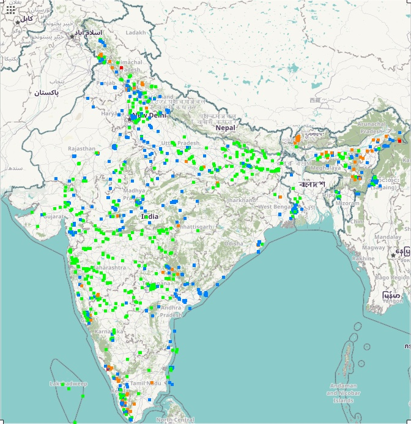

# Stations Dataset

Stations Dataset was found at: https://cpcb.nic.in/nwmp-monitoring-network/

This folder contains code to visually represent the water quality predictions on the map of India using 5px x 5px squares with color coding:

- very good: green
- good: blue
- bad: orange
- very bad: red

There is a small offset due to the curves on the planet, which can be fixed, but in this case is not.

